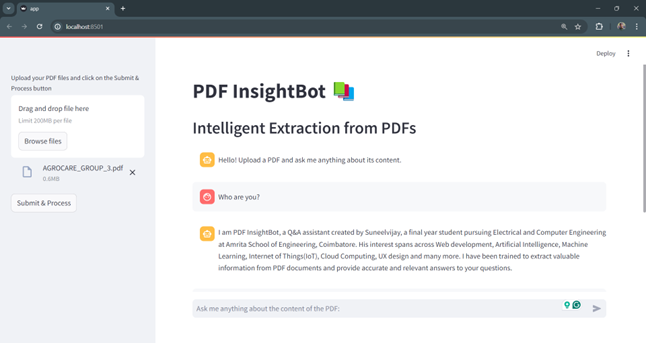
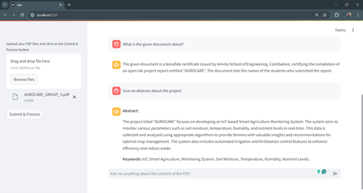

# PDF InsightBot

PDF InsightBot is a versatile and intelligent bot designed to extract insights, summaries, and detailed information from PDF documents. Using advanced Natural Language Processing (NLP) techniques, this bot can help users quickly understand and analyze PDF content.

LLM Model - google/gemma-1.1-7b-it  
Embeddings - BAAI/bge-small-en-v1.5  

# Features
* Text Extraction: Extract text content from PDF files.
* Summarization: Generate concise summaries of the extracted text.
* Keyword Extraction: Identify and highlight key terms and phrases.
* Question Answering: Answer questions based on the PDF content.
* Sentiment Analysis: Analyze the sentiment of the text within the PDF.

# Snapshots
UI of the PDF InsightBot:  
  
  
Response for User Queries:  
  
  

# Contributions
Contributions are welcome!  

- Fork the repository
- Create your feature branch (git checkout -b feature/awesome-feature)
- Commit your changes (git commit -m 'Add some awesome feature')
- Push to the branch (git push origin feature/awesome-feature)
- Open a pull request
